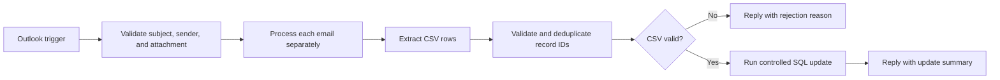

# Bulk Feedback Publication Automation

## Overview

This n8n workflow replaces a manual bulk-publication process with a controlled email and CSV workflow. An authorized user sends a CSV attachment to a monitored mailbox, and the automation validates the request, performs the database update, and replies once with the outcome.

## Workflow

## Engineering highlights

- Processes multiple emails independently when they arrive in the same polling window.
- Allows only a defined subject pattern, approved sender domain, and attachment-based request.
- Requires a known CSV header and numeric record identifiers.
- Removes duplicate IDs before building the update.
- Rejects the entire request when invalid values are detected.
- Enforces a maximum batch size to protect the database.
- Updates only records that are not already published.
- Sends one clear success or rejection response.

## Technologies

- n8n
- Microsoft Outlook / Microsoft Graph
- CSV processing
- Microsoft SQL Server

## Setup

1. Import `workflow-template.json` into n8n.
2. Select an Outlook OAuth credential for the trigger, message-download, and reply nodes.
3. Select a Microsoft SQL credential for the update node.
4. Replace the example sender-domain and subject rules.
5. Map `dbo.FeedbackRecords`, `FeedbackRecordId`, and `IsPublished` to your approved schema.
6. Test with a non-production database before activation.

## Input

See [sample-input.csv](sample-input.csv).

## Portfolio note

This is an anonymized template. Internal mailbox, database, and company-security configuration are not included.

