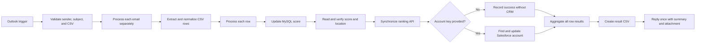

# Profile Ranking Operations Automation

## Overview

This event-driven workflow accepts bulk profile-ranking requests through a shared mailbox. Separate restore and adjustment paths validate the email and CSV, process every row, update and verify database state, synchronize an API, optionally update CRM, and send one consolidated response after the entire attachment finishes.

## Workflow

## Engineering highlights

- Supports two ranking actions through isolated email-trigger paths.
- Validates subject, internal sender, CSV presence, and required headers.
- Separates emails arriving in the same polling window.
- Processes every CSV row independently.
- Requires RoomKey while treating AccountKey as optional.
- Uses parameterized MySQL queries.
- Reads the updated row to verify the expected score and obtain the downstream location key.
- Calls the synchronization API only after database verification.
- Skips Salesforce cleanly when AccountKey is missing.
- Looks up and updates the related Salesforce account when available.
- Aggregates all successes and failures into one final result file.
- Replies once per email, not once per row.

## Technologies

- n8n
- Microsoft Outlook / Microsoft Graph
- CSV processing
- MySQL
- REST API
- Salesforce

## Setup

1. Import `workflow-template.json` into n8n.
2. Select Outlook, MySQL, and Salesforce credentials.
3. Replace the ranking API endpoint and authentication.
4. Map `ranking_demo.profile_rooms`, `adjustment_score`, `room_key`, and `location_key` to your schema.
5. Map the placeholder Salesforce fields to approved fields in your org.
6. Replace the example sender-domain and subject rules.
7. Test both actions, missing AccountKey, invalid RoomKey, API failure, and Salesforce failure.

## Input

See [sample-input.csv](sample-input.csv).

## Portfolio note

This repository does not include the monitored mailbox, internal API, database connection, Salesforce organization, or production data.

