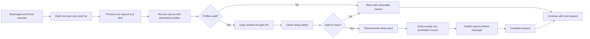

# Reviews and Ratings Migration Automation

## Overview

This workflow automates an approved profile-migration process that previously required spreadsheet preparation, database lookups, API execution, rating inserts, and downstream search synchronization. It processes requests one at a time and records durable checkpoints so interrupted work can resume safely.

## Workflow

## Engineering highlights

- Separates approved intake data from the private processing queue.
- Prevents a RequestId from being queued twice.
- Processes many requests sequentially to avoid cross-item data contamination.
- Resolves source and destination records and blocks missing or ambiguous matches.
- Prevents inserts when the destination already contains a rating record.
- Blocks when the destination rating count is greater than the source count.
- Uses a serializable SQL transaction and lock-based rechecks before insertion.
- Verifies that exactly one destination rating record exists after the insert.
- Publishes a downstream search-refresh message only after verification.
- Saves checkpoints after every critical stage.
- Resumes explicit retries and safely reclaims stranded requests.
- Returns blocked requests with a useful business comment instead of silently failing.

## Technologies

- n8n
- Microsoft Excel 365
- Microsoft SQL Server
- REST API
- AWS SQS

## Setup

1. Import `workflow-template.json` into n8n.
2. Replace all workbook, worksheet, and table placeholders.
3. Select Microsoft Excel, SQL Server, HTTP authentication, and AWS credentials.
4. Map the generic profile and rating tables to your approved schemas.
5. Replace the example API endpoint and SQS queue URL.
6. Confirm the workflow timezone and schedule.
7. Test new, blocked, retry, and duplicate scenarios before activation.

## Example intake

See [sample-sales-requests.csv](sample-sales-requests.csv). In the production design this data is stored in an Excel table with approval and automation-result columns.

## Portfolio note

The template uses generic profile and rating names. It contains no production resource IDs, endpoints, credentials, or business data.

