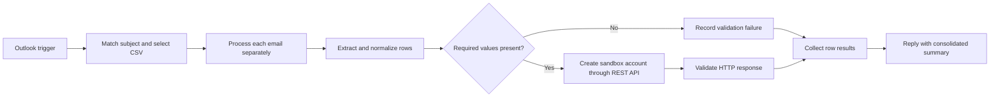

# Sandbox Account Provisioning Automation

## Overview

This n8n workflow demonstrates a controlled sandbox account-provisioning process. An Outlook trigger receives a test request, the workflow selects and validates the CSV attachment, each valid row is sent to a placeholder REST API, and the requester receives one consolidated reply with row-level results.

## Workflow

## Engineering highlights

- Matches the requested subject without depending on letter case.
- Selects the CSV attachment even when other attachments are present.
- Processes multiple emails independently when they arrive in one polling window.
- Accepts case-insensitive CSV headers and validates every required value.
- Prevents invalid rows from reaching the provisioning API.
- Throttles requests in batches to reduce load on the downstream service.
- Records HTTP status and response details without aborting the entire batch.
- Returns a clear row-level success or failure result in one Outlook reply.
- Uses only reserved example domains, generic fields, and placeholder identifiers.
- Keeps credentials unbound and the workflow inactive for safe portfolio use.

## Technologies

- n8n 2.6.4
- Microsoft Outlook / Microsoft Graph
- CSV processing
- REST API integration

## Setup

1. Import `workflow-template.json` into n8n 2.6.4.
2. Select the same Outlook OAuth2 credential for the trigger and reply nodes.
3. Review the non-routable placeholder endpoint and generic request schema in the HTTP Request node.
4. Send an unread test email whose subject contains `Sandbox account request` and attach a CSV matching `sample-input.csv`.
5. Map the generic fields to a sandbox system only if you choose to test the template.

## Input

Required CSV headers are `email`, `tenant_key`, `full_name`, and `password`. Header matching is case-insensitive.

See [sample-input.csv](sample-input.csv).

## Portfolio note

This is an anonymized sandbox template. It contains no production credentials, endpoints, account data, role identifiers, claim names, or company-specific configuration.
